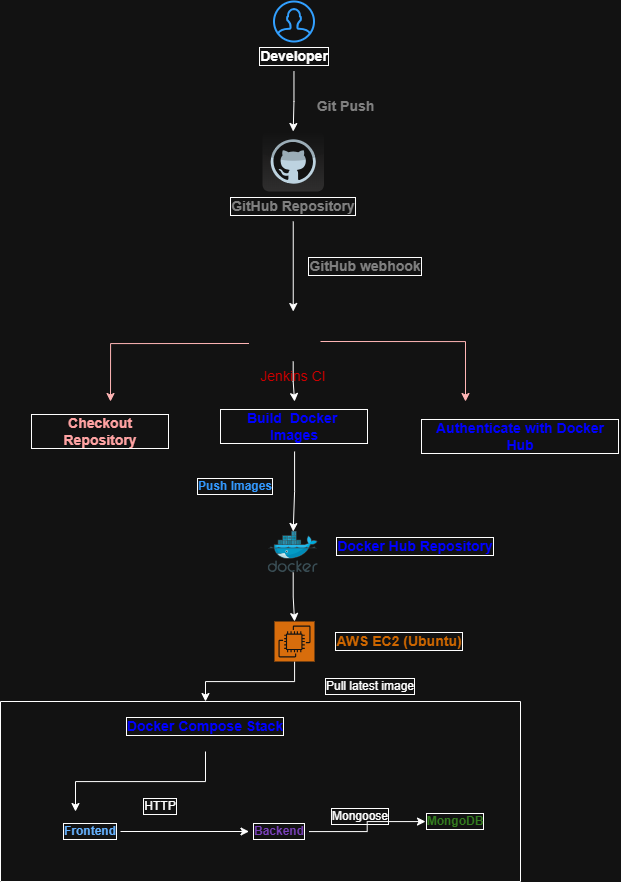
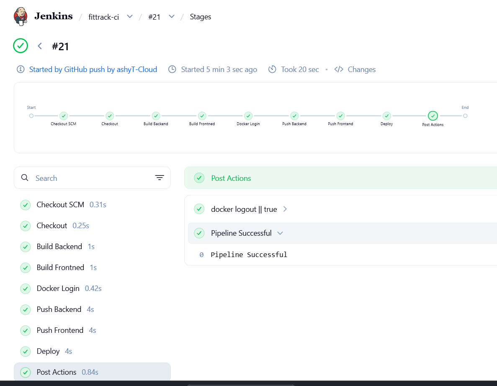
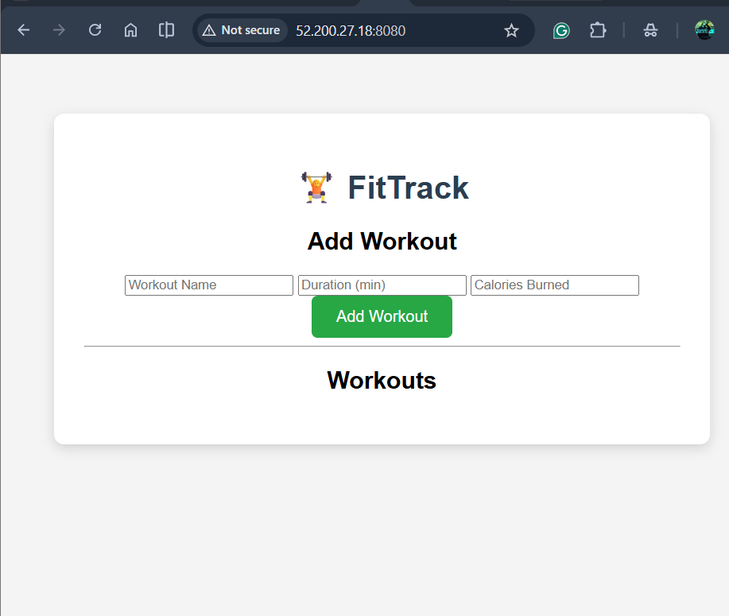
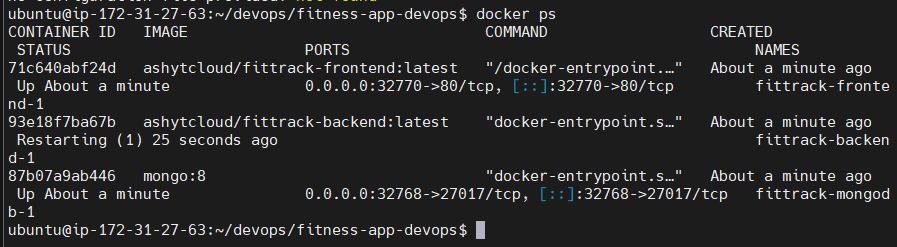

# 🚀 Dockerized 3-Tier Fitness Application with CI/CD on AWS


---

## 📌 Project Overview

This project demonstrates the deployment of a **Dockerized Three-Tier Fitness Application** using modern DevOps practices.

The application consists of:

- Frontend (HTML, CSS, JavaScript)
- Backend (Node.js & Express)
- MongoDB Database

The complete application is containerized using Docker, orchestrated with Docker Compose, and automatically built and deployed through a Jenkins CI/CD pipeline hosted on AWS EC2.

---

## 🏗 Architecture

> *(Architecture diagram will be added here)*

---

## 🚀 Tech Stack

| Category | Technology |
|-----------|------------|
| Cloud | AWS EC2 |
| Operating System | Ubuntu Linux |
| CI/CD | Jenkins |
| SCM | Git & GitHub |
| Containerization | Docker |
| Orchestration | Docker Compose |
| Registry | Docker Hub |
| Backend | Node.js, Express.js |
| Frontend | HTML, CSS, JavaScript |
| Database | MongoDB |
| Web Server | Nginx |

---

## 📂 Project Structure

```text
fitness-app-devops/
│
├── app/
├── compose/
├── docker/
├── docs/
├── scripts/
├── docker-compose.yml
├── Jenkinsfile
└── README.md
```

---

## ⚙️ CI/CD Workflow

```
Developer
    │
git push
    │
    ▼
GitHub
    │
Webhook
    ▼
Jenkins
    │
Checkout Code
    │
Build Docker Images
    │
Push Images to Docker Hub
    │
Deploy using Docker Compose
    ▼
AWS EC2
```

---

## ✨ Features

- Dockerized three-tier application
- Docker Compose deployment
- MongoDB integration
- Jenkins CI/CD pipeline
- GitHub Webhooks
- Docker Hub image publishing
- Automated deployment
- Environment variable management
- Production-inspired folder structure

---

# 📸 Project Screenshots

## Architecture Diagram



---

## Jenkins CI/CD Pipeline

The Jenkins pipeline automatically:

- Checks out the latest source code
- Builds backend & frontend Docker images
- Pushes images to Docker Hub
- Deploys the latest version on AWS EC2 using Docker Compose



---

## Running Application

FitTrack application successfully deployed on AWS EC2.



---

## Running Docker Containers

Docker Compose managing the complete application stack.


```
docs/screenshots/
```

---

## 🧠 Challenges Faced

During this project several real-world issues were encountered and resolved:

- Docker networking
- MongoDB authentication
- Environment variable injection
- Jenkins permissions
- Docker Hub authentication
- GitHub Webhook configuration
- EC2 disk space management
- Container naming conflicts
- Docker Compose deployment issues

---

## Environment Variables

For local development:

```bash
cp deploy/.env.example deploy/.env
```

Update the values as required before deployment.

In Jenkins, the production `.env` file is injected securely using Jenkins Credentials (Secret File).

# 🚀 CI/CD Pipeline

```text
Developer
    │
Git Push
    │
GitHub Repository
    │
GitHub Webhook
    │
Jenkins Pipeline
    │
Build Docker Images
    │
Push Docker Images
    │
Docker Hub
    │
AWS EC2
    │
Docker Compose
    │
Frontend + Backend + MongoDB
```

## 🚀 Future Improvements

- Kubernetes (AWS EKS)
- Terraform Infrastructure
- Prometheus Monitoring
- Grafana Dashboards
- HTTPS with Nginx
- GitOps using ArgoCD
- Secrets Management

---

## 👨‍💻 Author

Ashish Thakur

Cloud & DevOps Engineer

GitHub:
https://github.com/ashyT-Cloud

---
